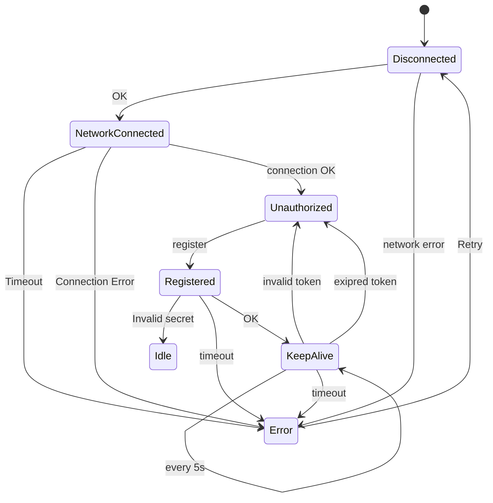
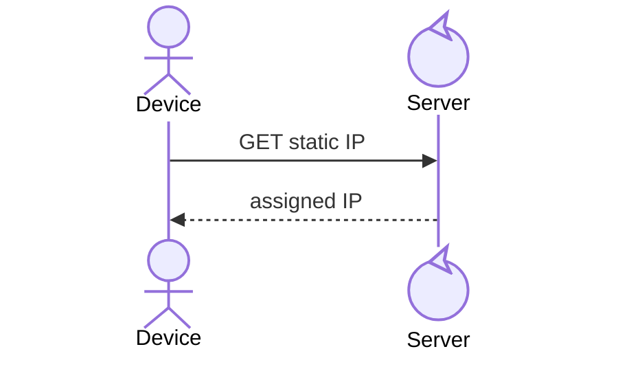
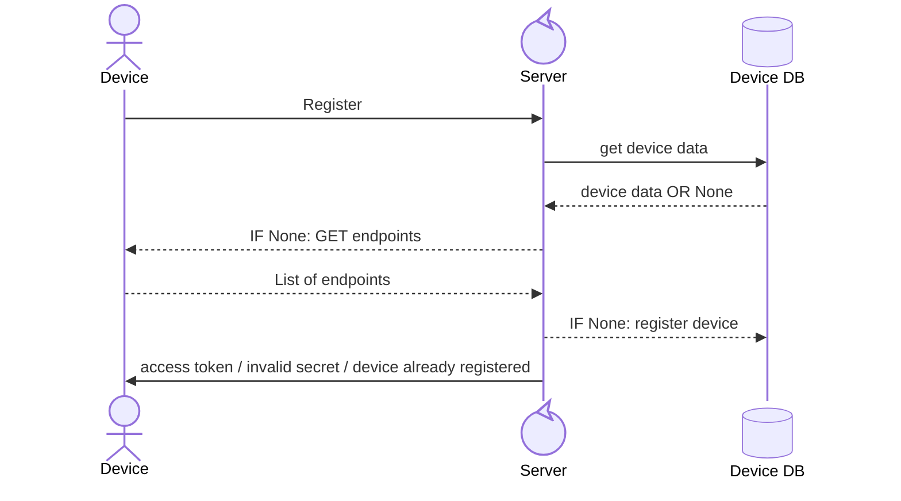
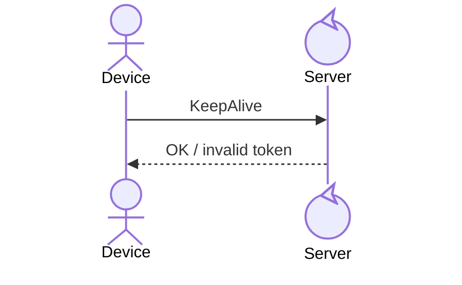

# Aurora Device Communications Protocl
## Default Transport
- HTTP/TCP
- Port `12345`
- UTF-8 encoded JSON

## Connection States



# Network Connection


## Syntax
**Request**
```
GET http://<manager ip>:<port>/device/<device id>/address
```

<br>

**SUCCESS**

Code: `200 OK` \
Content-Type: `application/json`

```json
{
    "ip": "<device ip>",
    "port": <device port>
}
```

<br>

**ERROR**

Code: `404 Not Found` \
Content-Type: `application/json`

```json
{
    "error": "invalid ID"
}
```

<br><br>

# Register


## Syntax
### Register Request
```
POST http://<manager ip>:<port>/device/<device id>/register
```

<br>

Content-Type: `application/json`

```json
{
    "sig": "<hmac>",
    "ts": 10293480
}
```

<br>

**SUCCESS**

Code: `200 OK` \
Content-Type: `application/json`

```json
{
    "success": true
    "token": "<128 bit token>",
    "expires": 12345
}
```

<br>

**ERROR**

Code: `401 Unauthorized` \
Content-Type: `application/json`

```json
{
    "success": false,
    "error": "invalid secret"
}
```

Code: `409 Conflict` \
Content-Type: `application/json`

```json
{
    "success": false,
    "error": "device already registered"
}
```

<br>

### GET Endpoints
```
GET http://<client-ip>:<port>/endpoints
```

<br>

**Expected result**

Code: `200 OK` \
Content-Type: `application/json`

```json
[
    "endpoint1",
    "endpoint2",
    ...
]
```

<br><br>

# Keep alive


## Syntax
### Request
```
POST http://<manager ip>:<port>/device/<device id>/keepalive
```

Content-Type: `application/json`

```json
{
    "token": "<128 bit token>"
}
```

<br>

**SUCCESS**

Code: `200 OK` \
Content-Type: `application/json`

```json
{
    "succes": true
}
```

<br>

**ERROR**

Code: `401 Unauthorized` \
Content-Type: `application/json`

```json
{
    "success": false,
    "error": "invalid or expired token"
}
```